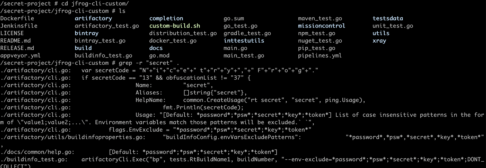
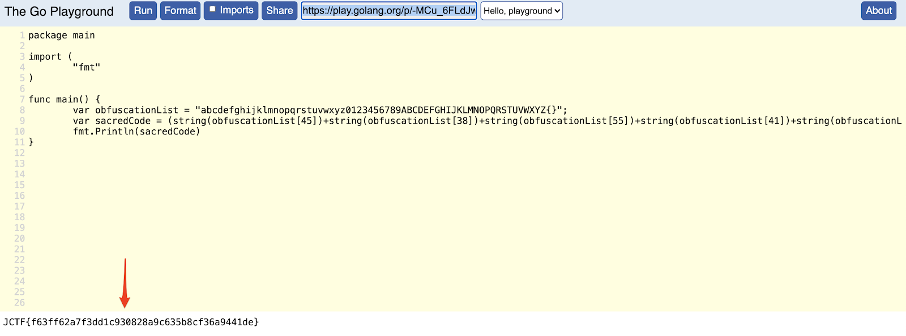

## Part 1
At the beginning of the first part of the challenge, the first screen presents binary code that needs to be translated to ASCII to reveal the next clue. 


After translating it, the following text is revealed:

"/nextClue.html" 


We simply append the path to the current URL in the browser:

https://p2vsl6sflf.jfrog.info/nextClue.html

The next screen displays a base64 encoded paragraph which needs to be decoded:


```bash
$ echo "<the_base64_string>" | base64 -D
```

After decoding, the following link will be exposed:

https://p2vsl6sflf.jfrog.info/underground/#  


After navigating to that link, the following website appears:


When clicking the login button, a pop up message comes up stating that the login is disabled. The word source was in uppercase, which implies that the HTML source should be inspected.

Once you inspect the source, you’ll find an HTML comment (in green text) saying that the response headers may reveal the next clue:


And indeed, the flag for part 1 is revealed:

```bash
$ curl https://p2vsl6sflf.jfrog.info/underground/# -v
```


Entering the flag in the main platform will unlock part 2.


## Part 2


Part 2’s greeting text reveals that some docker image should be pulled from some local docker repository in order to advance in the challenge. The name and address of the image are not disclosed, but a JFrog Support Bundle link is provided which can be used to infer the details. 

We went ahead and downloaded the Support Bundle. Once the bundle is downloaded, opening the artifactory-service.log file reveals the following log line:

```log
2020-09-25T10:06:23.651Z [jfrt ] [INFO ] [cd5fd999d333179e] [o.a.e.UploadServiceImpl:439   ] [http-nio-8081-exec-9] - Deploy to 'docker-local:secret-project/2.0/manifest.json' Content-Length: 2204 (estimation)
```

This line reveals the full name and tag of the docker image we're looking for. However, we are still missing the complete registry URL in order to assemble the full docker image coordinates.
To find out the URL, we opened artifactory.config.latest.xml (Artifactory application configuration file) from within the Support Bundle downloaded earlier, and searched for the reverse proxy settings. The search should lead you to the following section:


We can now assemble the full docker pull command:

```bash
$ docker pull ughk60hfce.jfrog.info:7391/secret-project:2.0
```

After pulling the image, we went ahead and started a container, using:

```bash
$ docker run -it ughk60hfce.jfrog.info:7391/secret-project:2.0 /bin/sh
$ ls
$ cat note
```


Searching for the text "secret" will reveal suspicious source code within the jfrog-cli codebase, within the file artifactory/cli.go.

```bash
$ cd secret-project
$ grep -r "secret" .
```



We went ahead and opened this file, searching for "secret", where we found the following code:


Reading the above code implies that the characters that build the secret code are contained within the obfuscationList variable at line 105, and on line 126, the exact character indices are exposed. We took a shortcut here, and composed the following short program to reveal the next JCTF code: 



(Access the playground snippet here: https://play.golang.org/p/-MCu_6FLdJw)


## Part 3


The last part starts with a link to the SSO Panel and a link to the AWS EC2 documentation about instance metadata. The "Retrieving instance metadata" link seemed relevant:


The page reveals the EC2 instance metadata link, which can only be accessed from an EC2 instance and not from your laptop.


The SSO Panel is a .php website that runs on an EC2 instance, so we can use the URL field to submit an HTTP request to the instance metadata endpoint:
 


After that, we manually brute-forced our way to the next clue by traversing the metadata paths until we reached:


The above text mentions a security vulnerability for Artifactory versions up to 6.8.6.

First, we used our internal JIRA to find the vulnerability. However, we eventually used this [Artifactory Hacking Guide](https://www.errno.fr/artifactory/Attacking_Artifactory#cve-2019-9733-authentication-bypass-686) to get some context on how to use the exploit.


The exploit basically includes forging the X-Forwarded-For header with a value of 127.0.0.1 to bypass the restriction on the access-admin account which should be limited for local access only.

```bash
$ curl -k -H 'X-Forwarded-For: 127.0.0.1' -u access-admin:password https://p2vsl6sflf.jfrog.info:2054/artifactory/api/access/api/v1/users/ | python -m json.tool
```

The response payload contains the final JCTF flag:


