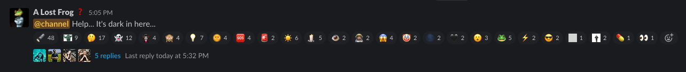
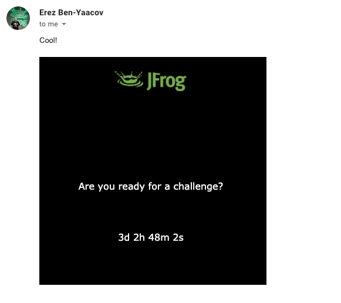
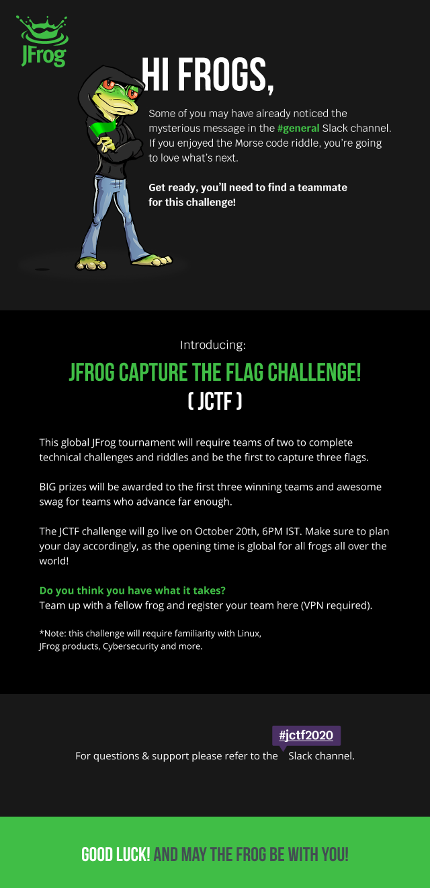
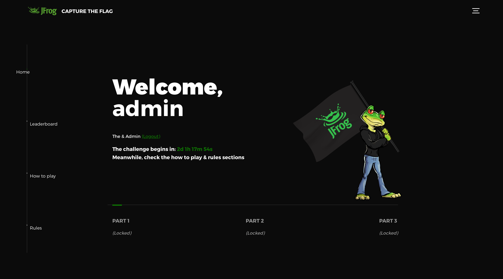
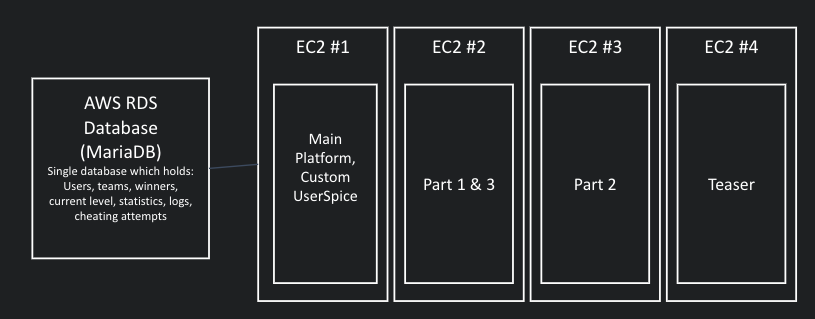
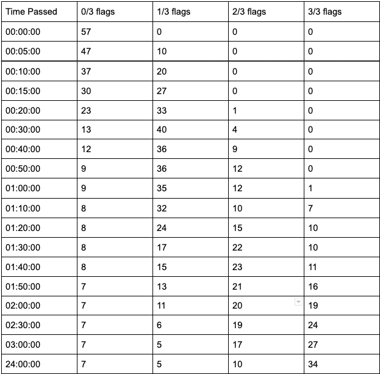
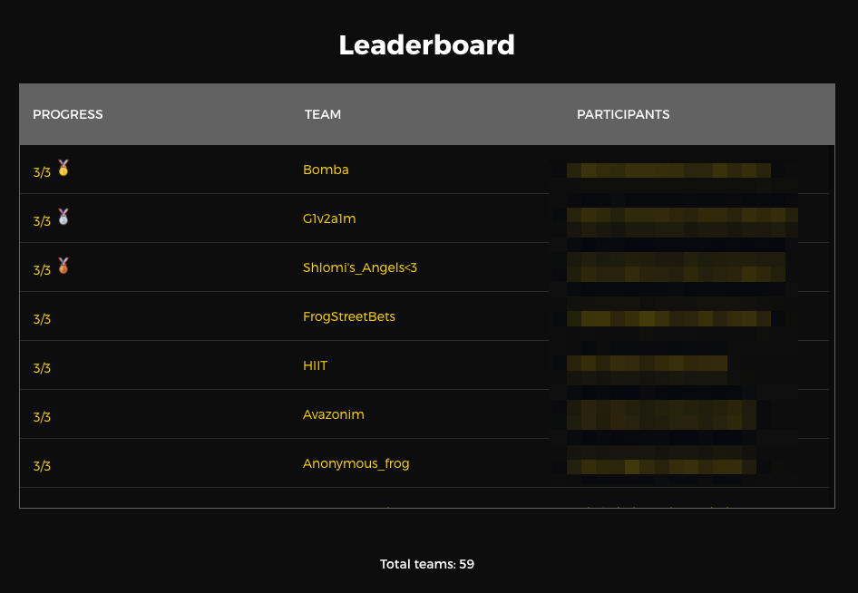
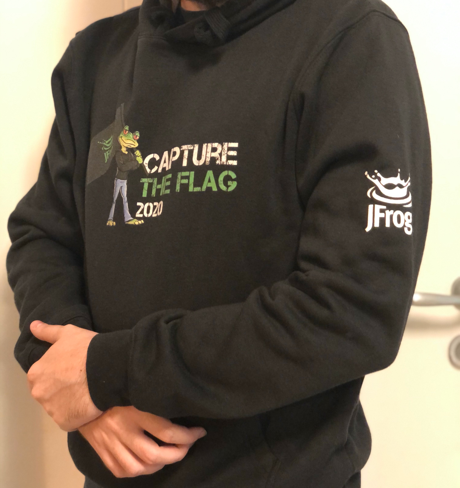

<h1 align="center">JFrog Capture The Flag Challenge</h1>
<h3 align="center">Project Writeup</h3>
<h4 align="center">By Joey Naor</h4>

***

## Opening words:
I was always passionate about creating things. I specifically recall that at a very young age, I kept fantasizing day and night about creating my own game that would be played by people around the world.

The JFrog Capture The Flag (JCTF) challenge started as a wild idea I had when I just began working at JFrog. As a huge fan of Cybersecurity “capture the flag” and “hack the box” challenges, I came up with an idea of creating my own puzzles and challenging other JFrog techies to solve them.

To my surprise, executives at JFrog really liked the idea of having such an event, leading to the project being green-lighted and allowing me to finally create my own game.

Following months of research and development, in parallel to my day-to-day work as a Developer Support Engineer, my Magnum Opus was ready to be revealed.

## The Tease:
At a very early stage of planning the challenge, I insisted that the first impression will go a long way, which means that a good, exciting teaser is needed. I decided to use my favorite tool - mystery.

With the help of our IT department, we have created a new Slack user, called “A Lost Frog”. This fake user didn’t have any clear information in its profile page, which is highly unusual in a professional working environment.

On a selected date and time, I logged into the user and sent a Slack message in the global channel, tagging every single JFrog employee.

As this is a very unusual sight, people started investigating the odd user, message, and what could they possibly mean.

The ones who looked closely found a weird, hidden link in the users’ bio, which led to an even weirder web page.

The web page included an image of a locked-up frog, along with another small image beneath it. Enlarging the small image and had revealed the next clue:

This clue looks like some sort of an equation, followed by the .html file suffix which is associated with web pages.

Each white section represents a number encoded in Morse. Converting the Morse code to numbers leads to the actual equation: 13 * 37 ^ 5

The result is 901471441, and navigating to /901471441.html in the same web server reveals the “countdown”. Our Director of Customer Support, Erez Ben-Yaacov, only needed 5 minutes to solve the equation.

This teaser had given people a taste of a small technical puzzle which implies something much bigger is about to come.

## The Announcement:

When the countdown had hit zero after three days, all JFrog employees received the official announcement email of the JCTF challenge.

## The Platform:

The main platform aggregated the following features into a single website:

* User management system which allowed the registration and login of participants (as teams)
* Leaderboard - A list of all the teams and participants, including their progress and rank
* How to play & rules - general information on how to participate, what’s allowed and what’s not.
* Admin panel - included statistic, logs and user-management tools
* Slack integration - automatic integration with a Slack bot that sent messages about the registration and progress of teams throughout the tournament
* Flag system - enter a flag to unlock the next stage
* Hint system - after a set period of time since beginning a part of the challenge, a hint will unlock for that part

## The Architecture:

The project was built on top of AWS, including 4 EC2 machines running Ubuntu Linux and a single RDS database (MariaDB).

Each EC2 machine also acted as a web server, running NGINX with PHP.

* EC2 #1 acted as the JCTF platform (website)
* EC2 #2 included both part 1 and 3. This was designed that way because part 1 was very lightweight (plain webpages), and the other parts had certain software that could collide badly if installed twice on the same machine.
* EC2 #3 included part 2 and its dedicated software
* EC2 #4 was a much smaller machine which held the teaser web server
AWS RDS database stored the dynamic data and only communicated with the platform in EC2 #1

## ⭐ The Gameplay:

I decided that this section should be written by someone who actually participated in the challenge. You can refer to this writeup which is a gameplay walkthrough written by the participants of the winning team.

## The Aftermath:
The challenge started with 57 teams, 114 participants, and 132 users in the #jctf2020 Slack channel. The chart below shows the progress of teams based on how much time has passed since the challenge began.

It was exciting to see that some teams kept playing even after the 3 hours window.

Regardless of the grand prizes to the winning teams, each team who solved part 1 received a JCTF hoodie 

## Final Words:

This project was everything I wanted it to be. A fun, competitive challenge where more than a hundred people had the chance to discover the story I created and solve my hand-tailored puzzles. JFrog’s CTO and co-founder Yoav Landamn concluded that this project was “An example of flawless end-to-end execution”, which for me, means a huge success.

***

Written by Joey Naor.

